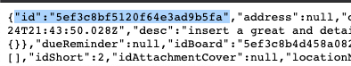

# Trello Steps

These steps allow you to **Create Cards**, **Update Cards**, and **Add Comments to Cards**.

---------

<kbd>

</kbd>

---------

# Files

* [TrelloSteps.zip](TrelloSteps.zip) - Workflow zip file with the step and example flow
* [trello.png](/trello.png) - Trello logo

# How it works
These steps use the [Trello API](https://developer.atlassian.com/cloud/trello/rest/) to Create, Update, and add comments to cards.

# Installation

## xMatters Setup
1. Download the [TrelloSteps.zip](TrelloSteps.zip) file onto your local computer
2. Navigate to the Workflows tab of your xMatters instance
3. Click Import, and select the zip file you just downloaded
4. Add the API Key and API Token Constants. How to find these values is explained below.

## Trello Setup

Get your Trello API Key and an API Token. [Here](https://developer.atlassian.com/cloud/trello/guides/rest-api/api-introduction/) are some instructions from Trello, but the steps needed will be summarized below.

1. Go to [https://trello.com/app-key](https://trello.com/app-key) to get your API Key.
2. Click the Hyperlinked **Token** beneath the API Key to generate a token.

Both of those values should be put into xMatters Constants.

Below are instructions to get various values you might need when using the steps.

Get Card and List ID

1. Select a card (or if getting List ID, any card on the list) you would like to find the ID of

2. In the URL, append `.json`

### Card ID

Search the page for `id`. Note: `not all values matching this will be the correct id. The first value on the page should be the right one.`

### List ID

Search the page for `idList`. Note: `not all values matching this will be the correct id. Some are surrounded with "old":{ <id> }. The first value on the page should be the right one.`

## Usage
The **GitHub - Get last commit** step is now available in your custom steps. So navigate to the appropriate canvas so you can add the step there. If you'd like to experiment with it, the **GitHub Steps** workflow has a canvas that can be triggered via HTTP call. 

### Inputs
| Name  | Required? | Min | Max | Help Text | Default Value | Multiline |
| ----- | ----------| --- | --- | --------- | ------------- | --------- |
| Repository | Yes | 0 | 2000 | repository | | No |

### Outputs

| Name | Description |
| ---- | ----------  |
| URL | URL |

## Example
This is an example showing the GitHub and Jenkins steps enriching the event before it is fired off to people. 

<kbd>
	
</kbd>

