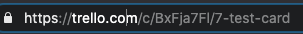
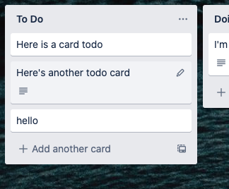
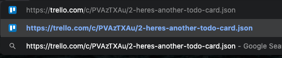
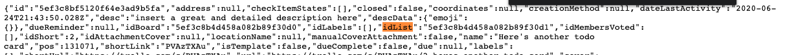

# Trello Steps

These steps allow you to **Create Cards**, **Update Cards**, and **Add Comments to Cards**.

---------

<kbd>

</kbd>

---------

# Files

* [TrelloSteps.zip](TrelloSteps.zip) - Workflow zip file with the step and example flow
* [trello.png](/trello.png) - Trello logo

# How it works
These steps use the [Trello API](https://developer.atlassian.com/cloud/trello/rest/) to Create, Update, and Add Comments to cards.

# Installation

## xMatters Setup
1. Download the [TrelloSteps.zip](TrelloSteps.zip) file onto your local computer
2. Navigate to the Workflows tab of your xMatters instance
3. Click Import, and select the zip file you just downloaded
4. Add the API Key and API Token Constants. How to find these values is explained below.

## Trello Setup

Get your Trello API Key and an API Token. [Here](https://developer.atlassian.com/cloud/trello/guides/rest-api/api-introduction/) are some instructions from Trello, but the steps needed will be summarized below.

1. Go to [https://trello.com/app-key](https://trello.com/app-key) to get your API Key.
2. Click the Hyperlinked **Token** beneath the API Key to generate a token.

Both of those values should be put into xMatters Constants.

Below are instructions to get various values you might need when using the steps.

Get Card ID

1. Select the card you would like to get the ID of.
2. Look in the URL, you will see the card ID. In this case the ID is `BxFja7FI`

"

**NOTE: Not all inputs accept this short ID, so try and use the full-length ID when possible**

Get List ID

1. Select any card on a list you would like to find the ID of

2. In the URL, append `.json`

### List ID

Search the page for `idList`. Note: `not all values matching this will be the correct id. Some are surrounded with "old":{ <id> }. The first value on the page should be the right one.`

## Usage
The **Trello - Create Card**, **Trello - Update Card**, and **Trello - Add Comment to Card** steps are now available in your custom steps. So navigate to the appropriate canvas so you can add the step there. If you'd like to experiment with it, the **Trello Steps** workflow has a canvas that can be triggered via HTTP call. 

When using the due date field, we've found formats like `June 20, 2020`, `20 June 2020`, or `6/20/2020` to work. Other formats should work too.

Each step calls one Trello API path.

##Trello - Create Card [/1/cards](https://developer.atlassian.com/cloud/trello/rest/?_ga=2.118514889.1765711000.1593034076-1069052946.1581371535#api-cards-post)

### Inputs
| Name  | Required? | Min | Max | Help Text | Default Value | Multiline |
| ----- | ----------| --- | --- | --------- | ------------- | --------- |
| API Key | Yes | 0 | 2000 | Your API Key from Trello | | No |
| API Token | Yes | 0 | 2000 | An API Token from Trello. | | No |
| idList | No | 0 | 2000 | ID of the list to add the new card to. | | No |
| Name | No | 0 | 2000 | The name for the card. | | No |
| Description | No | 0 | 2000 | The description for the card | | No |
| Position | No | 0 | 2000 | The position of the new card. top, bottom, or a positive float. | | No |
| Due Date | No | 0 | 2000 | The Due Date for the card. | | No |
| idMembers | No | 0 | 2000 | Comma-separated list of member IDs to add to the card. | | No |
| idLabels | No | 0 | 2000 | Comma-separated list of label IDs to add to the card | | No |
| idCardSource | No | 0 | 2000 | ID of a card to copy into the new card | | No |
| keepFromSource | No | 0 | 2000 | If using idCardSource you can specify which properties to copy over. all or comma-separated list of: attachments, checklists, comments, due, labels, members, stickers | | No |

### Outputs

| Name | Description |
| ---- | ----------  |
| ID | ID of the card |
| BoardID | ID of the board the card is in |
| ListID | ID of the list the card is in |
| URL | URL to the card |
| json | JSON response from the API Call |

---
##Trello - Update Card [/1/cards/{id}](https://developer.atlassian.com/cloud/trello/rest/?_ga=2.118514889.1765711000.1593034076-1069052946.1581371535#api-cards-id-put)

### Inputs
| Name  | Required? | Min | Max | Help Text | Default Value | Multiline |
| ----- | ----------| --- | --- | --------- | ------------- | --------- |
| API Key | Yes | 0 | 2000 | Your API Key from Trello | | No |
| API Token | Yes | 0 | 2000 | An API Token from Trello. | | No |
| ID | Yes | 0 | 2000 | The ID of the Card. | | No |
| Name | No | 0 | 2000 | The name for the card. | | No |
| Description | No | 0 | 2000 | The description for the card | | No |
| Closed | No | 0 | 2000 | (true) Archive the card. (false) Unarchive the card. | | No |
| idMembers | No | 0 | 2000 | Comma-separated list of member IDs to add to the card. | | No |
| idList | No | 0 | 2000 | ID of the list to add the new card to. | | No |
| idLabels | No | 0 | 2000 | Comma-separated list of label IDs to add to the card | | No |
| idBoard | No | 0 | 2000 | The ID of the board the card should be on | | No |
| Position | No | 0 | 2000 | The position of the new card. top, bottom, or a positive float. | | No |
| Due Date | No | 0 | 2000 | The Due Date for the card. | | No |

### Outputs

| Name | Description |
| ---- | ----------  |
| ID | ID of the card |
| BoardID | ID of the board the card is in |
| ListID | ID of the list the card is in |
| URL | URL to the card |
| json | JSON response from the API Call |

---
##Trello - Add Comment to Card [/1/cards/{id}/actions/comments](https://developer.atlassian.com/cloud/trello/rest/?_ga=2.118514889.1765711000.1593034076-1069052946.1581371535#api-cards-id-actions-comments-post)

### Inputs
| Name  | Required? | Min | Max | Help Text | Default Value | Multiline |
| ----- | ----------| --- | --- | --------- | ------------- | --------- |
| API Key | Yes | 0 | 2000 | Your API Key from Trello | | No |
| API Token | Yes | 0 | 2000 | An API Token from Trello. | | No |
| ID | Yes | 0 | 2000 | The ID of the Card. | | No |
| Text | Yes | 0 | 2000 | The comment. | | No |

### Outputs

| Name | Description |
| ---- | ----------  |
| ID | ID of the card |
| BoardID | ID of the board the card is in |
| ListID | ID of the list the card is in |
| URL | URL to the card |
| json | JSON response from the API Call |

## Example
This is what the Provided Flow looks like.

<kbd>
	
</kbd>

